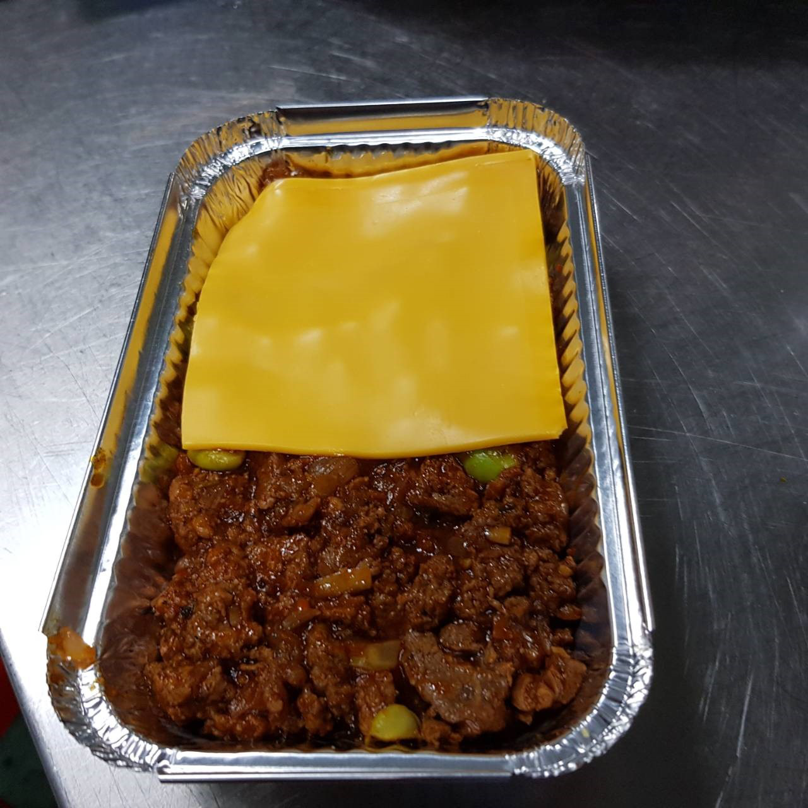

# 牧羊人派.md
* 材料：
1. 牛or豬絞肉, 600g
2. 洋蔥, 2顆
3. 大蒜, 80g
4. 迷迭香
5. 啤酒, 300cc
6. 番茄泥, 200g
7. 紅蘿蔔、西洋芹、碗豆仁、月桂葉
8. 馬鈴薯、奶油、鮮奶油、起司

* 作法：
1. 洋蔥、大蒜、爆香至金黃、加入絞肉扮炒出香味
2. 加入紅椒粉、調味鹽、番茄泥、迷迭香
3. 加入啤酒、紅蘿蔔丁、豌豆仁或西芹丁
4. 拌炒至水分略乾
5. 馬鈴薯去皮加鹽煮熟
6. 馬鈴薯瀝乾水分壓成泥
7. 馬鈴薯加入調味鹽、奶油、鮮奶油、起司
8. 烤盤底下鋪肉醬/加兩片切達起司（不能直接接觸烤箱會焦掉）/上層蓋馬鈴薯（肉和馬鈴薯各一半不能太厚）
9. 用叉子畫出紋路、灑一些帕瑪森起司條
10. 180度烤15分鐘上色

* 成品照

